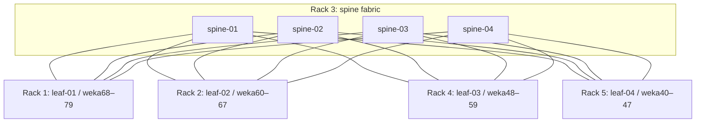

# Physical and logical topology

Five 48U racks. Each Supermicro chassis occupies 2U and contains four client
nodes. The chassis and node grouping is known; exact installed U positions
must be checked on site before treating rack elevations as an as-built record.

| Rack | Switches | Planned client block | Chassis count for planned block |
|---|---|---|---:|
| 1 | leaf-01 | weka68–79; 12 clients | 3 × 2U |
| 2 | leaf-02 | weka60–67; 8 clients | 2 × 2U |
| 3 | spine-01–04 and deferred leaf-05 | Infrastructure rack | Not assigned here |
| 4 | leaf-03 | weka48–59; 12 clients | 3 × 2U |
| 5 | leaf-04 | weka40–47; 8 clients | 2 × 2U |

Each line in this logical diagram represents eight parallel planned native
800G links. Each active leaf has 32 planned uplinks: eight to each spine.
Total planned links: 4 × 4 × 8 = 128. Missing links remain in the issue register.
Leaf-05 is physically in Rack 3 but is not part of this eight-switch rollout.

## Port groups

| Leaf ports | Remote spine | Spine ports for leaf-01 / 02 / 03 / 04 |
|---|---|---|
| swp33–40 | spine-01 | 1–8 / 9–16 / 17–24 / 25–32 |
| swp41–48 | spine-02 | Same blocks |
| swp49–56 | spine-03 | Same blocks |
| swp57–64 | spine-04 | Same blocks |

Client ports are the mapped breakout children in swp1–32. The client rollout
does not change swp33–64 or breakout mode. Detailed cable ends are in the
inventory CSVs; do not infer a child port from the host number.

## Routing path

A client sends to its local leaf gateway. The leaf routes through an established
spine next hop; that spine routes toward the destination leaf, which delivers
the packet to the destination client. BGP distributes the destination /31s.
Management and BMC addresses are used for access; they are not the RDMA data path.
The client pair shares a local leaf, so two NICs do not provide leaf-switch redundancy.

Switch identity, ASNs and router IDs are in `inventory/switches.json`.
All four spines use ASN 65200; leaves use 65101 through 65104.
