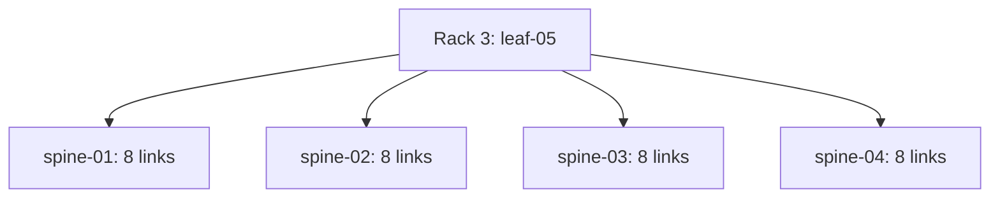

# Leaf-05: upgrade, connect and accept into production

Status: DRAFT — no discovery, upgrade, cabling or configuration has been performed by this package. Identity is confirmed by Sekhar: rack 3, management 172.31.17.3, current hostname MT2324XZ0TB0. The hostname has not yet been changed. This is an additional real production leaf, not a replacement for an existing leaf.

## 1. What changes and what is still unknown

The existing four leaves remain connected to all four spines. Leaf-05 gains eight 800G links to each spine, matching the existing uplink count per leaf. Its proposed server area is swp1–32; its proposed uplinks are swp33–64. No clients or backends are assigned to leaf-05 by this package. The 76-backend plan still places backends in racks 1, 2, 4 and 5.

| Item | Proposal | Required confirmation |
|---|---|---|
| Management | Keep 172.31.17.3 | Actual prefix, gateway, management VRF, DNS and access |
| Hostname | leaf-05 | Rename after successful upgrade and backup |
| ASN | 65105 | Inventory and route-policy collision check |
| Loopback/router ID | 10.255.0.15/32 | Address reservation and all-fabric conflict check |
| Underlay | 10.254.1.0/26, 32 /31s | New pool reservation; no reuse of occupied 10.254.0.0/24 |
| Spine ASN | Existing 65200 | Verify live configuration |
| Software | Match approved fleet release | Earlier project baseline was 5.11.5; verify actual installed fleet packages and supported upgrade path before selecting an image |
| Hardware | Expected SN5600 | Confirm model, serial, ASIC, supported image and cable matrix |
| Cable | 32 links at 800G | Qualified Ethernet cable/optic part numbers and actual lengths |

Do not treat a draft address or port as verified merely because it appears here. `plan.json` starts with every approval false. The command generator refuses incomplete plans and never connects to equipment.

## 2. Proposed physical topology and cable schedule



| Leaf-05 ports | Peer | Proposed peer ports | /31 pool | Links |
|---|---|---|---|---:|
| swp33–40 | spine-01, 172.31.17.5 | swp33–40 | 10.254.1.0–15 | 8 |
| swp41–48 | spine-02, 172.31.17.18 | swp33–40 | 10.254.1.16–31 | 8 |
| swp49–56 | spine-03, 172.31.17.20 | swp33–40 | 10.254.1.32–47 | 8 |
| swp57–64 | spine-04, 172.31.17.22 | swp33–40 | 10.254.1.48–63 | 8 |

Each row pairs ports in ascending order. The spine takes the even address; the leaf takes the odd address. `proposed-cabling.csv` contains all 32 exact pairs and /31 addresses. This reserves additional spine ports; it does not move existing swp1–32 connections. Verify swp33–40 are actually unused on every spine, including configuration, LLDP, optics, existing reservations and physical labels. Revise the plan if they are occupied.

DC Ops should label both ends with link ID, switch, port and rack; record cable part number, serial, length and installation date; confirm correct insertion and bend radius; then compare physical labels, LLDP and serial evidence with the schedule. Do not infer Ethernet compatibility from an IB NDR EEPROM label. Prior AXIOM cables had unresolved negotiation and wiring issues. Use the supported cable matrix and vendor guidance.

## 3. Collect evidence before making changes

Use the repository's `scripts/collect_switch_configs.sh` for the complete nine-switch snapshot. It already knows leaf-05's management address; ensure its identity check accepts the confirmed factory hostname. Keep unsanitized restore originals outside Git and publish only reviewed sanitized snapshots. Record the snapshot path in the change ticket.

On leaf-05, capture at minimum:

```bash
hostname
cat /etc/os-release
cat /etc/image-release
uname -a
dpkg-query -W 'cumulus*' 'nvue*' 'switchd*'
nv show system
nv config show
nv config show -o commands
nv config diff
ip -br address
ip -4 route show table all
nv show interface
nv show interface eth0
nv show qos roce
sudo vtysh -c 'show bgp ipv4 unicast summary'
```

On all four spines capture the same routing, QoS, interface, configuration and pending-diff evidence. Capture established peer identities as well as counts: a count alone can conceal one old peer being replaced by a new one. Capture routes to representative clients 40, 49, 60 and 68, and the established cross-leaf jumbo checks. Preserve existing known-down exceptions explicitly; they are not new successes.

## 4. Upgrade leaf-05 software before adding fabric cables

An image installation can erase local configuration. Establish and test console access, confirm power feeds, download a supported model-specific image from NVIDIA, validate its published SHA-256, save configuration and certificates outside the device, and record the management restoration steps. Keep new fabric uplinks disconnected or administratively disabled until the upgraded configuration has been reviewed. Do not upgrade any working spine as part of this leaf onboarding.

Choose the upgrade method from the actual source release and NVIDIA's target-release documentation. For a package-compatible transition, follow that release's documented repository and package procedure. Do not blindly run a generic distribution upgrade. For a required clean image installation, a reviewed Cumulus-side command is:

```bash
# Run ONLY on leaf-05 after console and management recovery preparation.
# Replace the location with the verified model/release image.
sudo onie-install -a -i <verified-image-location>
```

If already at the ONIE console, use its documented `onie-nos-install <verified-image-location>` path instead. These are disruptive manual commands; this package never executes an image upgrade. Confirm the exact command options with the installed tool and NVIDIA documentation. Reconnect by console, restore the management address/prefix/gateway/VRF and authentication, then verify SSH at 172.31.17.3 before any fabric work. Restore required certificates separately. Recreate supported configuration intentionally; do not copy a sanitized YAML export as a complete restore file.

After upgrade, capture the package versions and `/etc/os-release`, boot ID, management routes and services again. `/etc/image-release` alone may reflect the original base image after a package upgrade. Verify the expected release, time synchronization, no repeated switchd failures, management reachability and absence of unintended candidate changes. If any prerequisite fails, keep leaf-05 isolated and recover through console.

## 5. Generate and review additive fabric configuration

Fill `plan.json` only after evidence supports each approval and all link verification fields. Record the target release and image checksum. Run from the repository:

```bash
python3 packages/leaf05-onboarding/generate_commands.py
```

Generated files are review-only staging scripts and peer-test scripts. Review `generated/plan-lock.json` against the approved ticket and regenerate after any plan change. Verify the live spine routing policies allow the proposed loopback and future server prefixes. Check peer-group inheritance, prefix filters, maximum-prefix limits, multipath settings and any route maps against the existing fabric. The generator does not remove policies or overwrite the existing spine ASN/router IDs, and it does not assume a BGP summary means all routes are accepted.

The leaf candidate adds the approved hostname, loopback, ASN/router ID, numbered eBGP neighbors to the four spines, MTU 9216 and IPv4 forwarding on new uplinks, and the standard lossless RoCE profile. Spine candidates add only addresses and numbered neighbors on the approved new ports. Existing spine QoS must already be verified; the generator does not change it.

Back up each device and confirm `nv config diff` is empty before executing its generated `*-stage.sh` locally on that switch. Transfer the file with SCP after verifying the target hostname/IP. Check all staged commands and the resulting diff: no changes to existing leaf links, management, old BGP peers, server ports, breakout or unrelated QoS. A clean initial candidate check is a manual prerequisite, not an automatic property of the staging scripts.

## 6. Apply in controlled groups

Start with the eight links to spine-01. Stage only that group's approved commands on both endpoints; do not run the entire leaf script if conducting a group pilot. Review both diffs, then on each endpoint use:

```bash
nv config apply --assume-yes
nv config save
nv config diff
```

Wait for the eight new peers and verify the original spine peers and routes remain intact. Stop on missing peers or lost routes. Repeat for spine-02, spine-03 and spine-04. If the change window instead approves all 32 links together, the full generated leaf and four spine scripts can be staged and reviewed before applying; perform the same validation and preserve the same rollback evidence. Saving does not prove successful forwarding.

## 7. Physical, IP, BGP and RoCE acceptance

For every new link require matching LLDP neighbors, correct cable records, administratively up and carrier up, negotiated 800G, supported active FEC, MTU 9216, correct /31 and no master/bridge/bond attachment. Inspect `ethtool`, `ethtool --show-fec`, `ethtool -m`, `l1-show`, NVUE interface state and hardware counters. Read physical error and discard counter deltas before and after tests; investigate repeated link flaps and poor signal diagnostics even when ping succeeds.

Run the generated `*-peer-tests.sh` on each endpoint. It uses source IPs, five packets per peer, DF and 8972-byte ICMP payload for a 9000-byte IP packet. Success validates directly connected peers only.

```bash
sudo vtysh -c 'show bgp ipv4 unicast summary'
sudo vtysh -c 'show ip route 10.255.0.15/32'
sudo vtysh -c 'show ip route 10.200.40.0/31'
sudo vtysh -c 'show ip route 10.200.49.0/31'
sudo vtysh -c 'show ip route 10.200.60.0/31'
sudo vtysh -c 'show ip route 10.200.68.0/31'
nv show qos roce
```

Leaf-05 must have 32 new established neighbors, eight to each spine. Each spine must preserve all baseline established neighbors plus its eight new ones. Verify leaf-05's loopback on existing leaves and existing client /31 routes on leaf-05, including kernel forwarding routes and expected next hops. Compare prefix sets and policies, not only aggregate route totals.

Verify the effective RoCE profile on every new uplink and the four spines: lossless mode, priority 3 PFC, intended DSCP-to-priority mapping, traffic-class scheduling and ECN. Verify DSCP 24 and 26 reach the expected class for the current backend/client profiles. Uncongested throughput alone does not validate PFC or ECN behavior.

## 8. End-to-end testing requires a host connected to leaf-05

There are currently no assigned leaf-05 servers. Switch-to-switch pings cannot substitute for host-to-host RDMA acceptance. Select a dedicated test host, discover its NIC/MAC/RDMA port/GID and give each tested server link an independently approved /31. Add the matching leaf port address, forwarding and BGP prefix advertisement. Use the backend package's workflow only after its inventory and leaf support are deliberately extended; its current four-leaf mapping does not automatically include leaf-05.

Test both host ports with source-IP jumbo pings to representative hosts behind all four existing leaves, and run the reverse tests. Then run RDMA write bandwidth, individually and concurrently, in both directions between the leaf-05 test host and each representative host. Discover the actual RoCE v2 GID index and RDMA port; do not assume index 3 or port 1 on a dual-port adapter. Confirm effective traffic class and capture before/after counters. Use the perftest help from the installed version to select supported options. Compare results with the slower endpoint/link and host PCIe limits, not an unconditional 400G or 800G target.

During an approved maintenance test, disable one NEW uplink at a time, confirm route reconvergence and ongoing host traffic, then restore it. Also test loss of all eight new links to one spine, with traffic crossing leaf-05, and confirm recovery. Do not shut existing leaf uplinks. Run a controlled congestion test to demonstrate ECN/congestion response and absence of unexpected loss or pause storms. Record durations, load, counter deltas and expected disruption budgets before starting.

Finally run a WEKA mount/I/O smoke test through the intended client/backend path, check cluster protection and alerts from a backend or management host, and perform a leaf-05 reboot persistence test in the maintenance window. Verify the new boot ID, management access, saved configuration, 32 BGP neighbors, route sets, QoS and host jumbo/RDMA tests after reboot. If no leaf-05 test host is available, record SWITCH UNDERLAY ACCEPTED / HOST RDMA AND WEKA ACCEPTANCE PENDING, not production-ready.

## 9. Recovery and publication

If adding leaf-05 harms the existing fabric, stop and isolate only its new links. On each modified spine restore that device's reviewed pre-change configuration or remove only the new interface addresses/neighbors using an exact generated diff. Do not reset the spine or unset its entire BGP/QoS configuration. Review the rollback candidate before apply/save and verify original peer identities, routes and cross-leaf traffic. Use the repository recovery document for private backup handling. A software recovery on leaf-05 requires console and the compatible previous image; it is not a live nondisruptive downgrade.

Publish sanitized before/after snapshots, filled cable schedule, approved plan, software image filename/checksum, deployment diffs, peer/route evidence, test logs, heatmap, reboot evidence and remaining exceptions. Add leaf-05's active status to the authoritative inventory and topology only after acceptance; retain its factory hostname as provenance. Assign operator, reviewer, DC Ops contact and ongoing owner in the change record. Never commit passwords, private keys, tokens, raw credential-bearing backups or licensed software images.

## 10. Capacity after expansion

Conservative allocation reserves swp1–12 for existing clients, swp13–28 for 16 backend cages on leaf-01, swp13–32 for 20 backend cages on leaf-02/03/04, and swp33–64 for uplinks. Thus leaf-01 has four unallocated front-panel ports (swp29–32), the other three have none outside the client reservation. Each compatible 800G front-panel port can provide two 400G server connections. Unused client-area capacity is additional but must be checked against deferred clients and actual breakout/cabling.

If leaf-05 is added with the proposed 32 uplinks and no servers, swp1–32 supply 32 additional unallocated front-panel ports, potentially 64 × 400G connections. Combined conservative leaf capacity becomes 36 front-panel ports, potentially 72 × 400G connections. Each spine has 24 unallocated front-panel ports (swp41–64) after the proposed eight additional leaf-05 connections, subject to live inventory verification. These are unallocated design counts, not verified empty hardware ports.

## Sources and scope

NVIDIA Cumulus Linux 5.11 upgrade guide:
https://docs.nvidia.com/networking-ethernet-software/cumulus-linux-511/Installation-Management/Upgrading-Cumulus-Linux/

NVIDIA Cumulus Linux 5.11 basic BGP configuration:
https://docs.nvidia.com/networking-ethernet-software/cumulus-linux-511/Layer-3/Border-Gateway-Protocol-BGP/Basic-BGP-Configuration/

NVIDIA model/release-specific image installation and release notes must also be checked when the actual leaf-05 software and image are selected. Offline package syntax validation does not validate live hardware, upgrade compatibility, route-policy behavior or production acceptance.
